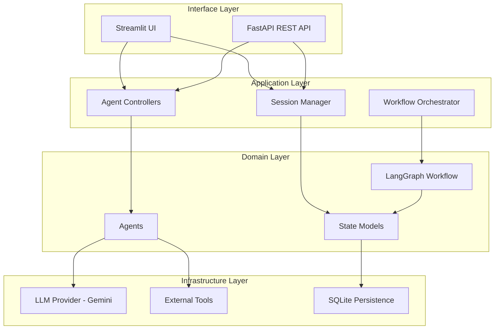

# Agent Council System Architecture

## Overview

The Agent Council is a multi-agent orchestration system built for Salesforce Professional Services, designed to provide collaborative architectural design review using LangGraph workflows.

## Architecture Layers

The system follows Clean Architecture principles with clear separation of concerns:

## Core Components

### 1. Interface Layer

**Streamlit UI**
- Council Setup: Create and configure sessions
- Agent Selector: Choose participating agents
- Feedback Panel: View agent outputs and reviews
- Approval Panel: Human-in-the-loop decision interface
- Final Output: Display completed designs and deliverables

**FastAPI REST API**
- Session management endpoints
- Workflow execution endpoints
- Agent execution endpoints
- Health and monitoring endpoints

### 2. Application Layer

**Session Manager**
- Session lifecycle management
- State persistence coordination
- Session CRUD operations

**Workflow Orchestrator**
- LangGraph workflow execution
- State transitions
- Agent coordination

**Agent Controllers**
- Agent instantiation
- Agent execution
- Response handling

### 3. Domain Layer

**Agents (Tool-Augmented)**

All agents now have tool integration capabilities:

- **Master Architect**: 
  - Coordinates council and synthesizes results
  - Uses: Gemini, NotebookLM

- **Solution Architect**: 
  - Creates and updates design documents
  - Uses: Gemini, Vibes (pattern recommendations), MCP (platform metadata), Lucid (diagrams)

- **NFR/Performance Reviewer**: 
  - Reviews performance and scalability
  - Uses: Gemini, MCP (runtime info), NotebookLM (evidence-based analysis)

- **Security Reviewer**: 
  - Reviews security and compliance
  - Uses: Gemini, MCP (policies), Vibes (best practices), NotebookLM (verification)

- **Integration Reviewer**: 
  - Reviews integration architecture
  - Uses: Gemini, Vibes (error handling), MCP (API metadata), NotebookLM (pattern analysis)

- **FAQ Agent**: 
  - Generates documentation and rationale
  - Uses: Gemini, NotebookLM (grounded summaries)

**Agent-Tool Integration Pattern**:
1. Agent receives task with allowed_tools list
2. Agent invokes tools asynchronously before reasoning
3. Tool results are formatted and included in agent prompt
4. Agent produces reasoning augmented with tool insights
5. Tool results are passed through workflow state for transparency

**LangGraph Workflow**
- Node definitions for each workflow step
- Conditional routing based on review outcomes
- Revision loop handling
- Human approval integration

**State Models**
- WorkflowState: Complete session state
- AgentMessage: Individual agent contributions
- ReviewFeedback: Structured review results
- DesignDocument: Evolving solution design

### 4. Infrastructure Layer

**LLM Provider (Google Gemini)**
- Mission Critical Data compliant
- Safety wrapper with prompt injection protection
- Retry logic and rate limiting
- JSON mode support

**External Tools (Phase 3A - Integrated)**

The system now includes a comprehensive tool integration layer:

- **MuleSoft Vibes**: 
  - API specification validation (RAML/OAS)
  - Best practice recommendations
  - Error handling pattern analysis
  - NFR validation

- **MCP Server** (MuleSoft Control Plane):
  - Environment configuration retrieval
  - API Manager metadata
  - Policy management
  - Runtime Fabric / CloudHub info
  - Client application registry

- **Lucid AI**:
  - Architecture diagram generation (Mermaid format)
  - Sequence diagram creation
  - Data flow visualization
  - Integration flow diagrams

- **Google Gemini**:
  - Long-context reasoning (1M+ tokens)
  - Structured analysis with JSON mode
  - Multi-modal understanding
  - Safety-wrapped generation

- **NotebookLM** (Simulated):
  - Grounded summaries with citations
  - Evidence-based question answering
  - Multi-document synthesis
  - Claim verification against sources

**Tool Integration Architecture**:
- BaseTool: Abstract base with timeout/retry protection
- ToolResult: Standardized response format
- Tool Registry: Centralized tool management
- Async execution: Non-blocking tool invocation
- Agent-tool binding: Agents specify allowed tools

**Persistence**
- SQLite database for session storage
- State serialization/deserialization
- Session history tracking

## Design Principles

### SOLID Principles

1. **Single Responsibility**: Each module has one clear purpose
2. **Open/Closed**: Extensible without modification
3. **Liskov Substitution**: Implementations are interchangeable
4. **Interface Segregation**: Focused, minimal interfaces
5. **Dependency Inversion**: Depend on abstractions

### Clean Architecture

- **Independence**: Layers are independent and testable
- **Testability**: Business logic isolated from frameworks
- **Framework Independence**: Core logic doesn't depend on UI/DB
- **Database Independence**: Domain doesn't know about persistence

## Security & Compliance

### Mission Critical Data Requirements

1. **LLM Provider**: Only Google Gemini approved
2. **Prompt Injection Protection**: Safety wrapper on all inputs
3. **PII Redaction**: Automated redaction in logs
4. **No Customer Data Leakage**: Sanitized inputs to LLM
5. **Audit Logging**: All decisions tracked

### Safety Mechanisms

- Anti-prompt-injection guards on system prompts
- Input sanitization and validation
- Output validation before returning to user
- Secrets redaction in logs
- Timeout and retry wrappers for external calls

## TODO: Phase 2 Enhancements

- [ ] Add detailed component diagrams
- [ ] Document API specifications
- [ ] Add deployment architecture
- [ ] Document scaling strategies
- [ ] Add monitoring and observability architecture
- [ ] Document disaster recovery procedures

