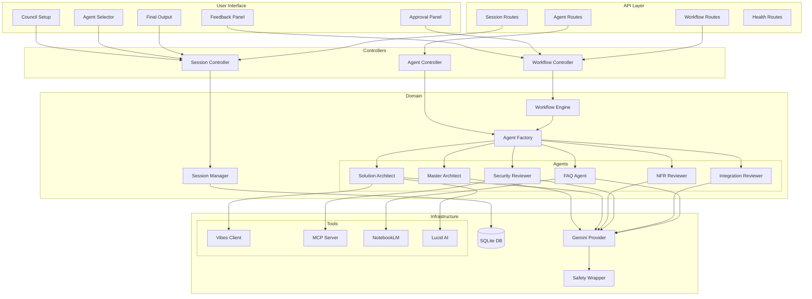
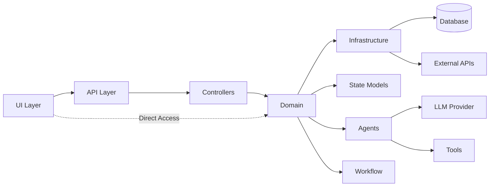

# Component Map

## System Component Overview

This document maps the relationships between UI, API, Workflow, LLM, Tools, and Storage components.

## Component Interaction Map



## Component Responsibilities

### UI Components

| Component | File | Responsibility |
|-----------|------|----------------|
| Council Setup | `app/ui/council_setup.py` | Session creation form, session list |
| Agent Selector | `app/ui/agent_selector.py` | Agent configuration interface |
| Feedback Panel | `app/ui/feedback_panel.py` | Display agent outputs and reviews |
| Approval Panel | `app/ui/approval_panel.py` | Human approval interface |
| Final Output | `app/ui/final_output.py` | Display final deliverables |
| Sidebar | `app/ui/sidebar.py` | Navigation and session info |
| Main View | `app/ui/main_view.py` | Content routing |

### API Components

| Component | File | Responsibility |
|-----------|------|----------------|
| Session Routes | `app/api/routes.py` | Session CRUD endpoints |
| Workflow Routes | `app/api/routes.py` | Workflow execution endpoints |
| Agent Routes | `app/api/routes.py` | Agent execution endpoints |
| Health Routes | `app/api/routes.py` | Health check endpoints |
| Schemas | `app/api/schemas.py` | Request/response models |
| Controllers | `app/api/controllers.py` | Business logic delegation |

### Domain Components

| Component | File | Responsibility |
|-----------|------|----------------|
| Session Manager | `app/state/session.py` | Session lifecycle management |
| Persistence Manager | `app/state/persistence.py` | Database operations |
| Workflow Engine | `app/graph/workflow.py` | LangGraph orchestration |
| Node Definitions | `app/graph/node_definitions.py` | Workflow node implementations |
| Evaluator | `app/graph/evaluator.py` | Conditional routing logic |
| State Models | `app/graph/state_models.py` | Workflow state definitions |
| Agent Factory | `app/agents/factory.py` | Agent instantiation |
| Master Architect | `app/agents/master_agent.py` | Requirement analysis |
| Solution Architect | `app/agents/solution_architect_agent.py` | Design creation |
| Reviewers | `app/agents/reviewer_agent.py` | Specialized reviews |
| FAQ Agent | `app/agents/faq_agent.py` | Documentation generation |
| Performer Base | `app/agents/performer.py` | Base for generators |
| Critic Base | `app/agents/critic.py` | Base for reviewers |

### Infrastructure Components

| Component | File | Responsibility |
|-----------|------|----------------|
| Gemini Provider | `app/llm/providers.py` | Google Gemini integration |
| LLM Factory | `app/llm/factory.py` | Provider instantiation |
| Model Catalog | `app/llm/model_catalog.py` | Model definitions |
| Safety Wrapper | `app/llm/safety.py` | Prompt injection protection |
| Vibes Client | `app/tools/vibes.py` | MuleSoft Vibes integration |
| MCP Client | `app/tools/mcp_server.py` | MCP Server integration |
| NotebookLM Client | `app/tools/notebooklm.py` | NotebookLM integration |
| Lucid AI Client | `app/tools/lucid_diagrams.py` | Diagram generation |
| Settings | `app/utils/settings.py` | Configuration management |
| Logging | `app/utils/logging.py` | Structured logging |
| Exceptions | `app/utils/exceptions.py` | Custom exceptions |
| Caching | `app/utils/caching.py` | In-memory cache |

## Data Flow

### Session Creation Flow

```
User → UI → Session Controller → Session Manager → Persistence Manager → Database
```

### Workflow Execution Flow

```
User → UI → Workflow Controller → Workflow Engine → Agent Factory → Agents → LLM Provider → Gemini API
                                                                    ↓
                                                              State Updates → Database
```

### Review Cycle Flow

```
Solution Architect → Design v1
                    ↓
    ┌───────────────┼───────────────┐
    ↓               ↓               ↓
NFR Reviewer   Sec Reviewer   Int Reviewer
    ↓               ↓               ↓
    └───────────────┼───────────────┘
                    ↓
                Evaluator → Decision → Next Node
```

## Dependency Graph



## Communication Patterns

### Synchronous
- UI → API (HTTP)
- API → Controllers → Domain (Direct calls)
- Agents → LLM Provider (HTTP with retry)
- Agents → Tools (HTTP with retry)

### Asynchronous (TODO: Phase 2)
- Workflow streaming updates
- Real-time UI updates via WebSocket
- Background job processing

### Event-Driven (TODO: Phase 2)
- Workflow state change events
- Agent completion events
- Review submission events

## TODO: Phase 2 Enhancements

- [ ] Add WebSocket connections for real-time updates
- [ ] Document caching strategies across components
- [ ] Add message queue for async processing
- [ ] Document monitoring and observability integration points
- [ ] Add component health checks
- [ ] Document scaling strategies per component

