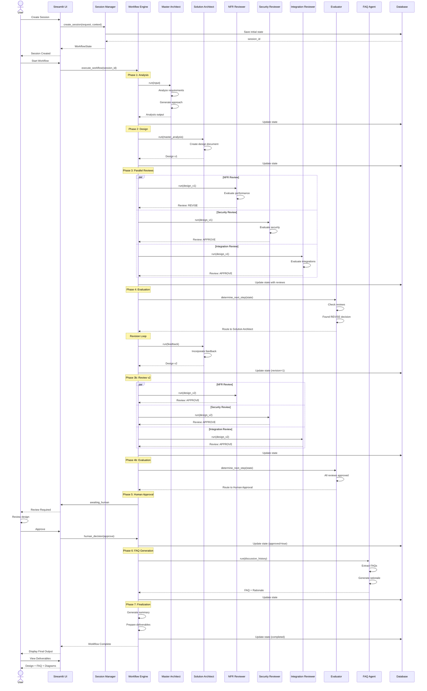
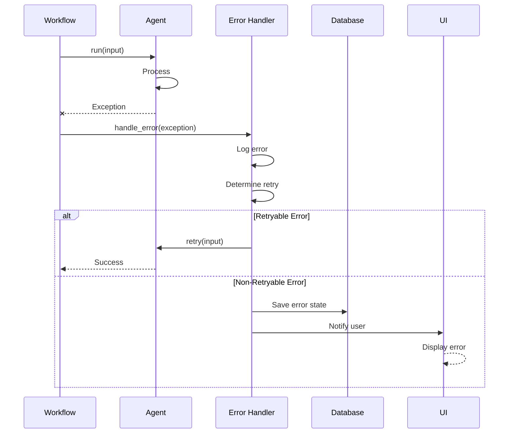

# Agent Council Sequence Diagram

## Complete Council Session Flow

## Key Interactions

### 1. Session Creation
- User provides requirements through UI
- Session Manager creates and persists initial state
- Returns session ID for tracking

### 2. Workflow Execution
- Workflow engine orchestrates agents sequentially and in parallel
- Each agent receives state and context
- Agents return structured outputs
- State updated after each step

### 3. Review Cycle
- Multiple reviewers evaluate design in parallel
- Reviews consolidated by evaluator
- Conditional routing based on outcomes
- Supports iterative refinement

### 4. Human Approval
- Workflow pauses for human decision
- UI displays design and reviews
- Human provides approval/rejection/feedback
- Workflow resumes based on decision

### 5. Finalization
- FAQ agent synthesizes discussion
- Final deliverables prepared
- State marked as completed
- Results displayed to user

## Error Handling Flow

## TODO: Phase 2 Enhancements

- [ ] Add streaming sequence for real-time updates
- [ ] Document timeout handling
- [ ] Add rollback sequences
- [ ] Document concurrent execution details
- [ ] Add LangSmith tracing integration
- [ ] Document checkpoint/resume sequences

