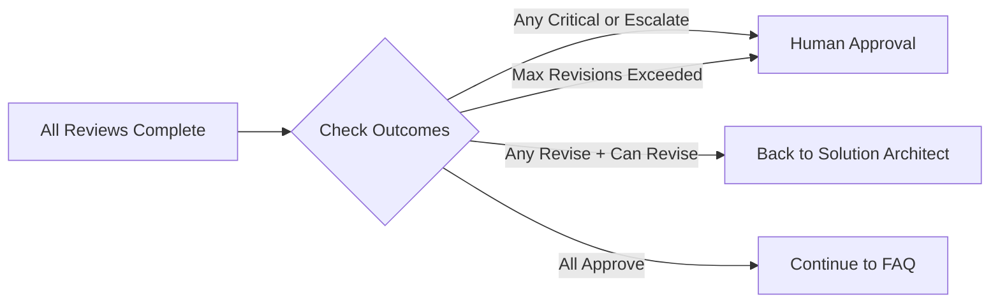
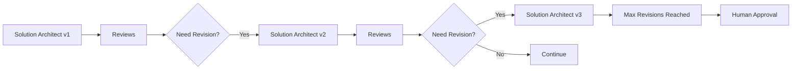

# Agent Council Workflow

## Overview

The Agent Council workflow is implemented using LangGraph, a framework for building stateful, multi-agent applications. The workflow orchestrates multiple specialized agents through a deterministic state machine with conditional routing.

## Workflow Diagram


## Workflow Phases

### Phase 1: Initial Analysis

**Master Architect Node**
- Receives user requirements
- Performs initial analysis
- Identifies key considerations
- Generates clarifying questions
- Creates delegation plan for reviewers

**Input:**
- User request/requirements
- Context information (industry, org size, use case, etc.)

**Output:**
- Requirements summary
- Key considerations
- Proposed high-level approach
- Questions for clarification
- Areas requiring specialist review

### Phase 2: Design Creation

**Solution Architect Node**
- Creates comprehensive design document
- Considers requirements from Master Architect
- Incorporates feedback from previous revisions (if any)
- Generates initial architecture

**Input:**
- Master Architect analysis
- Previous review feedback (if revision)
- User context

**Output:**
- Design document with:
  - Architecture overview
  - Components and responsibilities
  - Integration points
  - NFR considerations
  - Security considerations
  - Deployment strategy

### Phase 3: Specialized Review

**Reviewer Nodes (Parallel)**

The following reviewers evaluate the design concurrently:

1. **NFR/Performance Reviewer**
   - Performance bottlenecks
   - Scalability concerns
   - Governor limits compliance
   - Caching strategies
   - Resource optimization

2. **Security Reviewer**
   - Authentication and authorization
   - Data encryption
   - API security
   - Compliance requirements
   - Security best practices

3. **Integration Reviewer**
   - API design and patterns
   - Error handling
   - Data transformation
   - Integration resilience
   - Monitoring strategies

**Input:** Design document from Solution Architect

**Output:** Structured review feedback
- Decision: approve, revise, reject, escalate
- Concerns: List of issues found
- Suggestions: Actionable improvements
- Rationale: Explanation of decision
- Severity: low, medium, high, critical

### Phase 4: Review Evaluation

**Workflow Evaluator**

Conditional routing based on review outcomes:



**Evaluation Logic:**

1. **Check for Escalation:**
   - Any review with "escalate" decision
   - Any review with "critical" severity
   - Max revisions exceeded

2. **Check for Revision:**
   - Any review with "revise" decision
   - Revision count < max revisions
   - No critical issues

3. **Check for Approval:**
   - All reviews have "approve" decision
   - No blocking concerns

### Phase 5: Human Approval (Conditional)

**Human Approval Node**

Triggered when:
- Critical issues identified
- Reviewers request escalation
- Maximum revisions exceeded
- Ambiguous review outcomes

**Human Options:**
1. **Approve**: Proceed to FAQ generation
2. **Request Revision**: Back to Solution Architect with feedback
3. **Reject**: Cancel session

**Input:**
- Design document
- All review feedback
- Revision history

**Output:**
- Human decision (approve/revise/reject)
- Human feedback and guidance

### Phase 6: FAQ and Documentation

**FAQ Agent Node**

Generates knowledge artifacts:
- FAQ entries from council discussions
- Decision rationale documentation
- Key takeaways for stakeholders
- Trade-offs and alternatives considered

**Input:**
- All agent messages
- Review feedback
- Design evolution history

**Output:**
- FAQ entries (question, answer, category)
- Decision rationale
- Key takeaways
- Trade-off analysis

### Phase 7: Finalization

**Finalize Node**

Completes the workflow:
- Marks session as completed
- Generates final summary
- Exports diagrams (via Lucid AI)
- Creates deliverables package

**Output:**
- Final design document
- FAQ and documentation
- Diagrams and visuals
- Complete session history

## Revision Loop

The workflow supports iterative refinement:



**Revision Limits:**
- Default: 3 maximum revisions
- Configurable per session
- Prevents infinite loops
- Escalates to human after limit

## State Management

**WorkflowState**

The complete state object passed through all nodes:

```python
{
    "session_id": "unique-id",
    "status": "in_progress",
    "user_request": "original request",
    "current_design": DesignDocument,
    "messages": [AgentMessage],
    "reviews": [ReviewFeedback],
    "revision_count": 2,
    "human_approved": False,
    "faq_entries": [],
    "final_design": None
}
```

State is:
- Serializable (Pydantic models)
- Persisted after each node
- Restorable for workflow resumption
- Traceable for debugging

## TODO: Phase 2 Enhancements

- [ ] Implement streaming updates for UI
- [ ] Add parallel reviewer coordination
- [ ] Implement workflow checkpointing
- [ ] Add workflow pause/resume
- [ ] Implement partial workflow execution
- [ ] Add workflow branching for alternative designs
- [ ] Implement workflow templates
- [ ] Add workflow analytics and metrics

