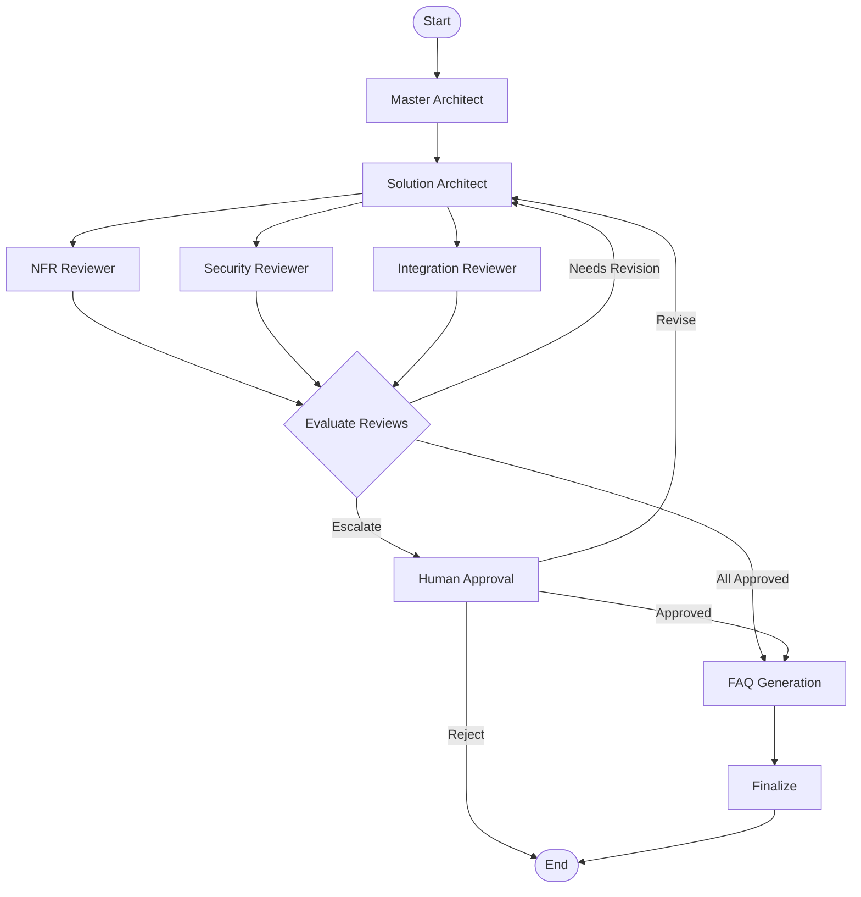
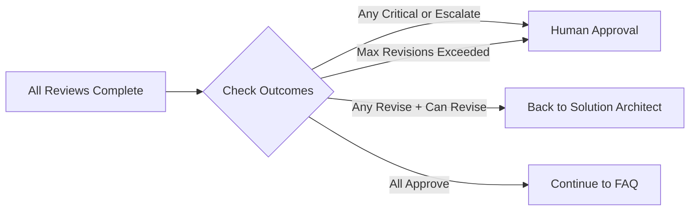
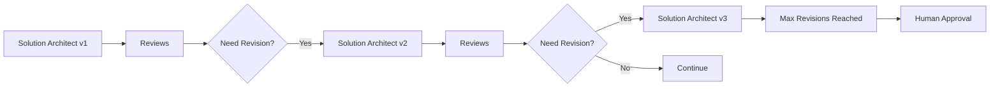

# Agent Council Workflow

## Overview

The Agent Council workflow is implemented using LangGraph, a framework for building stateful, multi-agent applications. The workflow orchestrates multiple specialized agents through a deterministic state machine with conditional routing.

## Workflow Diagram



## Workflow Phases

### Phase 1: Initial Analysis

**Master Architect Node**
- Receives user requirements
- Performs initial analysis
- Identifies key considerations
- Generates clarifying questions
- Creates delegation plan for reviewers

**Input:**
- User request/requirements
- Context information (industry, org size, use case, etc.)

**Output:**
- Requirements summary
- Key considerations
- Proposed high-level approach
- Questions for clarification
- Areas requiring specialist review

### Phase 2: Design Creation (Tool-Augmented)

**Solution Architect Node**
- Invokes tools before design creation:
  - **Vibes**: Recommends integration patterns based on requirements
  - **MCP Server**: Fetches environment info and available policies
  - **Lucid AI**: Generates architecture diagrams from descriptions
- Creates comprehensive design document
- Incorporates tool insights into design reasoning
- Considers requirements from Master Architect
- Incorporates feedback from previous revisions (if any)

**Input:**
- Master Architect analysis
- Previous review feedback (if revision)
- User context

**Tool Invocations:**
- Vibes: `recommend_patterns(description)`
- MCP: `get_environment_info(env_id)`, `list_policies(env_id)`
- Lucid: `generate_architecture(description)` (if design_description provided)

**Output:**
- Design document with:
  - Architecture overview (augmented with tool recommendations)
  - Components and responsibilities
  - Integration points (validated against platform metadata)
  - NFR considerations
  - Security considerations (informed by available policies)
  - Deployment strategy
  - Diagrams (generated via Lucid)
- Tool results metadata for transparency

### Phase 3: Specialized Review (Tool-Augmented)

**Reviewer Nodes (Parallel)**

The following reviewers evaluate the design concurrently, each using specialized tools:

1. **NFR/Performance Reviewer**
   - **Tools Used**: MCP (runtime info), NotebookLM (evidence-based analysis)
   - Evaluates performance bottlenecks
   - Analyzes scalability concerns with actual platform capacity
   - Validates Governor limits compliance
   - Reviews caching strategies
   - Assesses resource optimization against deployment config

2. **Security Reviewer**
   - **Tools Used**: MCP (policy list), Vibes (best practices), NotebookLM (verification)
   - Validates authentication and authorization against available policies
   - Reviews data encryption implementation
   - Analyzes API security with platform-specific context
   - Verifies compliance requirements
   - Cross-checks security best practices with Vibes recommendations

3. **Integration Reviewer**
   - **Tools Used**: Vibes (error handling), MCP (API metadata), NotebookLM (pattern analysis)
   - Evaluates API design and patterns against MuleSoft best practices
   - Validates error handling strategies with Vibes
   - Data transformation
   - Integration resilience
   - Monitoring strategies

**Input:** Design document from Solution Architect

**Output:** Structured review feedback
- Decision: approve, revise, reject, escalate
- Concerns: List of issues found
- Suggestions: Actionable improvements
- Rationale: Explanation of decision
- Severity: low, medium, high, critical

### Phase 4: Review Evaluation

**Workflow Evaluator**

Conditional routing based on review outcomes:



**Evaluation Logic:**

1. **Check for Escalation:**
   - Any review with "escalate" decision
   - Any review with "critical" severity
   - Max revisions exceeded

2. **Check for Revision:**
   - Any review with "revise" decision
   - Revision count < max revisions
   - No critical issues

3. **Check for Approval:**
   - All reviews have "approve" decision
   - No blocking concerns

### Phase 5: Human Approval (Conditional)

**Human Approval Node**

Triggered when:
- Critical issues identified
- Reviewers request escalation
- Maximum revisions exceeded
- Ambiguous review outcomes

**Human Options:**
1. **Approve**: Proceed to FAQ generation
2. **Request Revision**: Back to Solution Architect with feedback
3. **Reject**: Cancel session

**Input:**
- Design document
- All review feedback
- Revision history

**Output:**
- Human decision (approve/revise/reject)
- Human feedback and guidance

### Phase 6: FAQ and Documentation

**FAQ Agent Node**

Generates knowledge artifacts:
- FAQ entries from council discussions
- Decision rationale documentation
- Key takeaways for stakeholders
- Trade-offs and alternatives considered

**Input:**
- All agent messages
- Review feedback
- Design evolution history

**Output:**
- FAQ entries (question, answer, category)
- Decision rationale
- Key takeaways
- Trade-off analysis

### Phase 7: Finalization

**Finalize Node**

Completes the workflow:
- Marks session as completed
- Generates final summary
- Exports diagrams (via Lucid AI)
- Creates deliverables package

**Output:**
- Final design document
- FAQ and documentation
- Diagrams and visuals
- Complete session history

## Revision Loop

The workflow supports iterative refinement:



**Revision Limits:**
- Default: 3 maximum revisions
- Configurable per session
- Prevents infinite loops
- Escalates to human after limit

## State Management

**WorkflowState**

The complete state object passed through all nodes:

```python
{
    "session_id": "unique-id",
    "status": "in_progress",
    "user_request": "original request",
    "current_design": DesignDocument,
    "messages": [AgentMessage],
    "reviews": [ReviewFeedback],
    "revision_count": 2,
    "human_approved": False,
    "faq_entries": [],
    "final_design": None
}
```

State is:
- Serializable (Pydantic models)
- Persisted after each node
- Restorable for workflow resumption
- Traceable for debugging

## Workflow Execution (Phase 2C)

### API Endpoints

**Start Workflow:**
```bash
POST /api/v1/workflow/{session_id}/start
```
Starts workflow execution in background. Returns immediately with status `in_progress`.

**Approve Design:**
```bash
POST /api/v1/workflow/{session_id}/approve
{
  "comment": "Looks good, proceed"
}
```
Approves design when status is `awaiting_human`. Continues to FAQ generation.

**Request Revision:**
```bash
POST /api/v1/workflow/{session_id}/revise
{
  "comment": "Please address security concerns"
}
```
Requests revision when status is `awaiting_human`. Sends back to Solution Architect.

**Get Status:**
```bash
GET /api/v1/workflow/{session_id}/status
```
Returns current workflow status and results.

### Workflow States

| Status | Description | User Action |
|--------|-------------|-------------|
| `pending` | Not yet started | Can start workflow |
| `in_progress` | Executing | Wait and poll status |
| `awaiting_human` | Needs approval | Approve or request revision |
| `completed` | Finished successfully | View final output |
| `failed` | Error occurred | Review error and retry |
| `cancelled` | User cancelled | Create new session |

### Execution Flow

1. **Start**: User clicks "Start Council" in UI
   - API receives `POST /workflow/{session_id}/start`
   - Workflow runs in background thread
   - Status changes to `in_progress`

2. **Agents Execute**:
   - Master Architect analyzes requirements
   - Solution Architect creates design
   - Reviewers evaluate in parallel
   - Status remains `in_progress`

3. **Human Approval** (if needed):
   - Status changes to `awaiting_human`
   - UI displays approval panel
   - User approves or requests revision

4. **FAQ Generation**:
   - FAQ Agent extracts Q&A from discussion
   - Populates `faq_entries` and `decision_rationale`

5. **Finalize**:
   - Status changes to `completed`
   - Final design and FAQ available
   - UI shows final output

### State Persistence

After each node execution:
1. State is updated with node results
2. State is persisted to SQLite
3. UI can poll and display current state

This ensures:
- Progress is not lost on failures
- Real-time status updates available
- Workflow resumable after interruption

## Phase 3A: Tool Integration (Completed)

### Tool-Augmented Agent Architecture

All agents now have access to external tools for enhanced reasoning:

**Tool Execution Pattern:**
1. Agent receives task with `allowed_tools` configuration
2. Before generating response, agent invokes relevant tools asynchronously
3. Tool results are formatted and injected into agent prompt context
4. Agent generates reasoning that incorporates tool insights
5. Tool results are attached to agent messages in workflow state
6. Tool results flow through state machine for full traceability

**Available Tools:**
- **Vibes**: MuleSoft best practices (pattern recommendations, error handling, NFR validation)
- **MCP Server**: Platform metadata (environments, APIs, policies, runtime config)
- **Lucid AI**: Diagram generation (architecture, sequence, data flow, integration)
- **Gemini**: Long-context reasoning (summarization, structured analysis, insight extraction)
- **NotebookLM**: Grounded analysis (cited summaries, evidence-based Q&A, claim verification)

**Benefits:**
- Agents no longer hallucinate platform-specific details
- Recommendations grounded in actual environment configuration
- Diagrams auto-generated from design descriptions
- Reviews backed by evidence from source documents
- FAQ Agent can cite specific sources for rationale

**State Model Updates:**
- `AgentMessage.tool_results`: List of tool invocation results
- `WorkflowState.add_message()`: Now accepts `tool_results` parameter
- Node definitions updated to pass tool results through workflow

## Phase 3B: Future Enhancements

- [ ] Implement streaming updates for UI (WebSocket/SSE)
- [ ] Add LangGraph checkpointing for better pause/resume
- [ ] Implement workflow branching for alternative designs
- [ ] Add workflow templates
- [ ] ✅ Integrate tool APIs (Vibes, MCP, Lucid, NotebookLM) - **COMPLETED**
- [ ] Add workflow analytics and metrics
- [ ] Implement workflow versioning
- [ ] Add tool result visualization in UI
- [ ] Implement tool caching for repeated queries
- [ ] Add tool usage analytics and cost tracking

